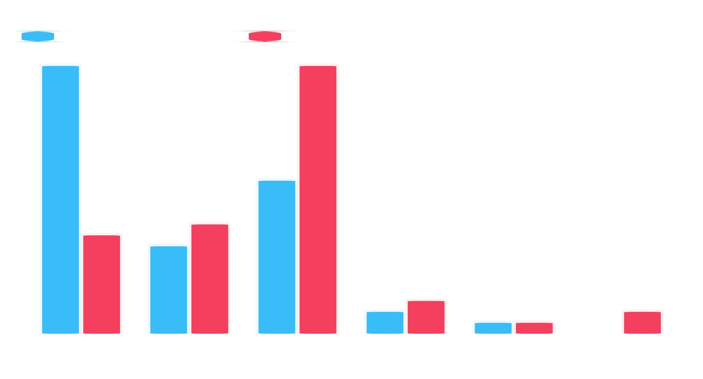
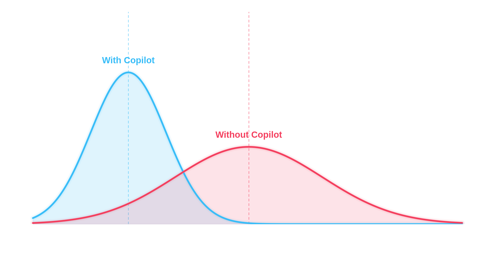

<!-- _class: cover -->
# Methodologies Under Review
## Content Analysis & Experimental Research

<center>
  
</center>

###### Scan to view source code on GitHub

###### By Jared Bridgewater

---

# Content Analysis: Overview
## Parsing Human Artifacts as Data

Two philosophies for turning observation into evidence — starting with the one that looks backward.

Content Analysis is a systematic, replicable technique for compressing many words of text into fewer content categories based on explicit rules of coding.

* **Primary Data Type:** Primarily **Qualitative** data sources transformed into **Quantitative** metrics.
* **The Core Engine:** You are parsing communications (text, source code, videos, logs) to uncover hidden patterns.

---

# Content Analysis: Implementation Pipeline

To execute this rigorously, researchers follow a deterministic data pipeline:

1. **Sampling:** Define the universe of data (e.g., *every commit message in a GitHub repo over 12 months*).
2. **Unitizing:** Break data into operational units (sentences, words, functions).
3. **Coding:** Apply a systematic "codebook" to label data (e.g., Category `0` = Obsolete Comment, Category `1` = Functional Comment).
4. **Statistical Analysis:** Calculate inter-rater reliability and frequency distributions.

---

# Content Analysis: Case Study
## Quality Analysis of Source Code Comments (Steidl et al., 2013)

* **The Problem:** Software maintenance accounts for up to 80% of total software costs; bad documentation kills velocity.
* **The Methodology:**
  * Researchers built a 7-category codebook (copyright, header, member, inline, section, task, commented-out code).
  * Used a **Java + C/C++ machine-learning classifier**, trained on 830 hand-tagged comments, to categorize real open-source repositories.
  * Case study applied this codebook to 5 open-source Java projects (jMol, ConQAT, jEdit, voTUM, JUNG).
* **The Result:** The simple comment ratio alone ranked ConQAT the "best documented" project — classification reveals *why* that's misleading.

---

<!-- _class: chart -->

# Content Analysis: Quantitative Findings
## Structural Breakdown of Repository Documentation



###### A pattern, not a cause: same overall comment ratio, completely different documentation profiles.

---

# Experimental Research: Overview
## Establishing Definitive Causality

Unlike Content Analysis which observes existing data, **Experimental Research** actively manipulates the environment to prove cause and effect.

* **Primary Data Type:** Strictly **Quantitative**.
* **The Core Engine:** Isolating an independent variable (X) to measure its direct impact on a dependent variable (Y) while suppressing all external noise (confounding variables).

---

# Experimental Research: Architecture

## Algorithmic Representation of an Experimental Design
#
```python
def run_controlled_experiment(population_pool):
    # Step 1: Strict Random Assignment (Eliminates Bias)
    group_A, group_B = random_split(population_pool)
    
    # Step 2: Introduce Independent Variable to Experimental Group Only
    metrics_A = measure_productivity(apply_treatment(group_A)) # Experimental
    metrics_B = measure_productivity(baseline_control(group_B)) # Control
    
    # Step 3: Evaluate Statistical Significance (e.g., p-value < 0.05)
    return run_t_test(metrics_A, metrics_B)
```

*In plain English:* Randomly split people into two groups, give one group the treatment, and compare their outcomes to see whether the difference is truly meaningful rather than just random noise.

---

# Experimental Research: Case Study
## The Impact of GitHub Copilot on Developer Productivity (Peng et al., 2023)

* **The Problem:** Quantifying whether LLM pair-programmers actually increase velocity or just introduce errors.
* **The Methodology:**
  * **Participants:** 95 developers randomly split — 45 treated, 50 control.
  * **Control Group:** Implemented an HTTP server in JavaScript *without* Copilot.
  * **Experimental Group:** Implemented the exact same server *with* Copilot enabled.
* **The Result:** The experimental group completed the task **55.8% faster** (71.2 min vs. 160.9 min, *p* = 0.0017).

---

<!-- _class: chart -->

# Experimental Research: Visualizing Causal Inference

## Distribution of Task Completion Times



###### Independent variable ($X$ = Copilot access) shifts the entire distribution of the dependent variable ($Y$ = completion time), not just the mean.

---

# Methodological Synthesis

Both case studies above reduced messy reality to a number — here's how they got there differently:

| Feature | Content Analysis | Experimental Research |
| :--- | :--- | :--- |
| **Objective** | Uncover patterns in communication. | Establish causal links ($X \rightarrow Y$). |
| **Data Source** | Existing artifacts (Static). | Generated via trial (Dynamic). |
| **Manipulation** | **None.** Observational only. | **High.** Active intervention. |
| **Core Risk** | Subjective coding bias. | Confounding environmental variables. |

---

<!-- _class: cites -->

# Works Cited

Peng, S., Kalliamvakou, E., Cihon, P., & Demirer, M. (2023). The impact of AI on developer productivity: Evidence from GitHub Copilot. *arXiv*. https://doi.org/10.48550/arXiv.2302.06590

Steidl, D., Hummel, B., & Jürgens, E. (2013). Quality analysis of source code comments. In *2013 IEEE 21st International Conference on Program Comprehension (ICPC)* (pp. 83–92). IEEE. https://doi.org/10.1109/ICPC.2013.6613836

Anthropic. (2026). Claude (Sonnet 5) [Large language model]. https://claude.ai

<p class="disclosure"><em>Claude assisted in generating the data-visualization code and chart styling for the two